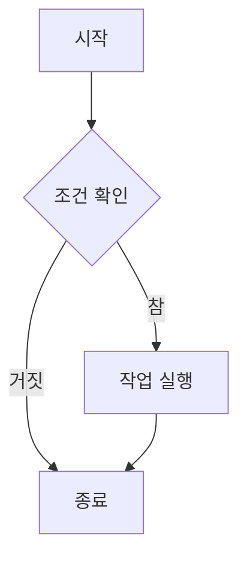
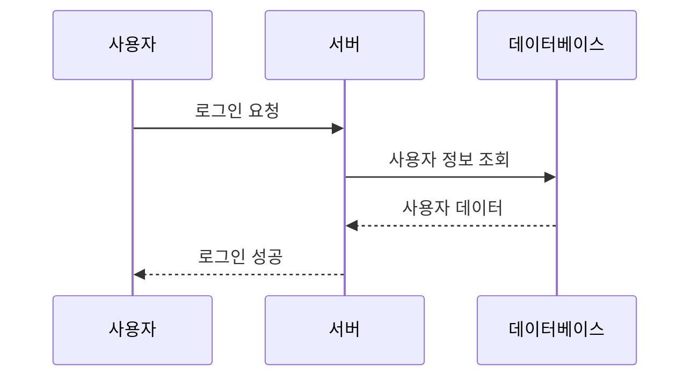

> 이 가이드는 Claude (Anthropic)의 도움을 받아 Jekyll Chirpy 테마의 공식 문서와 실제 사용 경험을 바탕으로 작성되었습니다. Chirpy의 모든 기능을 활용한 포스트 작성법을 익혀보세요.
{: .prompt-tip }

## 1. 기본 설정

### 파일명 규칙

Chirpy 포스트는 반드시 다음 형식을 따라야 합니다:

```
_posts/YYYY-MM-DD-title.md
```

**예시:**
- `2025-01-03-chirpy-writing-guide.md`
- `2025-01-03-my-first-post.markdown`

> **주의**: 확장자는 반드시 `.md` 또는 `.markdown`이어야 합니다.
{: .prompt-warning }

### 기본 Front Matter

모든 포스트는 다음과 같은 Front Matter로 시작해야 합니다:

```yaml
---
title: "포스트 제목"
date: 2025-01-03 15:00:00 +0900
categories: [상위카테고리, 하위카테고리]
tags: [태그1, 태그2, 태그3]
description: "포스트 설명 (SEO 및 소셜 미디어용)"
---
```

## 2. Front Matter 완전 가이드

### 필수 설정

```yaml
---
title: "포스트 제목"                    # 필수
date: 2025-01-03 15:00:00 +0900        # 필수 (타임존 포함)
categories: [Blog, Tutorial]            # 최대 2개 레벨
tags: [jekyll, chirpy, guide]           # 소문자 권장
---
```

### 선택적 설정

```yaml
---
# 기본 설정
description: "포스트 요약 설명"
author: author_id                       # _data/authors.yml 참조
authors: [author1, author2]             # 다중 작성자

# 레이아웃 제어
toc: false                              # 목차 비활성화
comments: false                         # 댓글 비활성화
pin: true                               # 홈페이지 상단 고정

# 고급 기능
math: true                              # 수학 표현식 활성화
mermaid: true                           # 다이어그램 활성화
media_subpath: /assets/img/posts/       # 미디어 경로 접두사

# 이미지 설정
image:
  path: /assets/img/posts/example.png   # 대표 이미지
  alt: "이미지 설명"                    # 접근성을 위한 대체 텍스트
  width: 1200                          # 이미지 폭 (선택)
  height: 630                          # 이미지 높이 (선택)
  lqip: /assets/img/posts/example-lqip.jpg  # 저품질 미리보기
---
```

### 타임존 설정

정확한 포스트 날짜를 위해 타임존을 반드시 지정하세요:

```yaml
date: 2025-01-03 15:00:00 +0900  # 한국 표준시
date: 2025-01-03 15:00:00 +0000  # UTC
date: 2025-01-03 15:00:00 -0500  # 동부 표준시
```

## 3. 이미지 처리

### 기본 이미지 삽입

```markdown

_이미지 캡션_
```

### 이미지 크기 지정

```markdown
{: width="700" height="400" }

<!-- 축약형 (v5.0.0+) -->
{: w="700" h="400" }
```

### 이미지 위치 조정

```markdown
<!-- 가운데 정렬 (기본값) -->
{: .normal }

<!-- 왼쪽 정렬 -->
{: .left }

<!-- 오른쪽 정렬 -->
{: .right }
```

### 다크/라이트 모드 이미지

```markdown
{: .light }
{: .dark }
```

### 그림자 효과

```markdown
{: .shadow }
```

### 저품질 이미지 미리보기 (LQIP)

```markdown
<!-- 일반 이미지에 LQIP 적용 -->
{: lqip="/path/to/lqip-file.jpg" }

<!-- Front Matter에서 대표 이미지에 LQIP 설정 -->
---
image:
  path: /path/to/image.jpg
  lqip: /path/to/lqip-file.jpg  # 또는 base64 URI
---
```

## 4. 코드 블록

### 기본 코드 블록

````markdown
```python
def hello_world():
    print("Hello, Chirpy!")
```
````

### 파일명 지정

````markdown
```python
def hello_world():
    print("Hello, Chirpy!")
```
{: file="hello.py" }
````

### 줄 번호 숨기기

````markdown
```shell
echo 'No line numbers!'
```
{: .nolineno }
````

### 인라인 코드

```markdown
이것은 `인라인 코드`입니다.
```

### 파일 경로 하이라이트

```markdown
`/path/to/file.txt`{: .filepath}
```

### Liquid 코드 표시

Liquid 코드를 텍스트로 표시하려면 `raw` 태그로 감싸거나, Front Matter에 `render_with_liquid: false`를 추가하세요:

**방법 1: raw 태그 사용**

```markdown

```liquid

  This product's title contains the word Pack.

```

```

**방법 2: Front Matter 설정**

```yaml
---
render_with_liquid: false
---
```

## 5. 수학 표현식

### 활성화

```yaml
---
math: true
---
```

### 블록 수식

```markdown
$$
\begin{equation}
E = mc^2
\label{eq:einstein}
\end{equation}
$$

수식 \eqref{eq:einstein}는 아인슈타인의 유명한 공식입니다.
```

### 인라인 수식

```markdown
이 문장에는 $$ E = mc^2 $$ 인라인 수식이 포함되어 있습니다.
```

### 리스트 내 수식

```markdown
1. \$$ a^2 + b^2 = c^2 $$
2. \$$ F = ma $$
3. \$$ V = IR $$
```

## 6. Mermaid 다이어그램

### 활성화

```yaml
---
mermaid: true
---
```

### 플로우차트 예시

````markdown

````

### 시퀀스 다이어그램

````markdown

````

## 7. 미디어 임베드

### YouTube 동영상


```liquid

```


### Twitch 동영상


```liquid

```


### Bilibili 동영상


```liquid

```


### 비디오 파일


```liquid

```


### 고급 비디오 옵션


```liquid

```


### 오디오 파일


```liquid

```


### 고급 오디오 옵션


```liquid

```


## 8. 프롬프트 (알림 상자)

### 팁

```markdown
> 이것은 도움이 되는 팁입니다.
{: .prompt-tip }
```

### 정보

```markdown
> 중요한 정보를 전달합니다.
{: .prompt-info }
```

### 경고

```markdown
> 주의해야 할 내용입니다.
{: .prompt-warning }
```

### 위험

```markdown
> 매우 중요한 경고사항입니다.
{: .prompt-danger }
```

## 9. 고급 기능

### 포스트 고정

홈페이지 상단에 포스트를 고정하려면:

```yaml
---
pin: true
---
```

### 목차 비활성화

```yaml
---
toc: false
---
```

### 댓글 비활성화

```yaml
---
comments: false
---
```

### 작성자 정보

`_data/authors.yml` 파일 생성:

```yaml
john_doe:
  name: John Doe
  twitter: johndoe
  url: https://johndoe.com

jane_smith:
  name: Jane Smith
  twitter: janesmith
  url: https://janesmith.com
```

포스트에서 사용:

```yaml
---
author: john_doe
# 또는 다중 작성자
authors: [john_doe, jane_smith]
---
```

## 10. SEO 및 소셜 미디어 최적화

### 대표 이미지 설정

소셜 미디어 공유를 위한 대표 이미지는 1200 x 630 픽셀(1.91:1 비율) 권장:

```yaml
---
image:
  path: /assets/img/posts/social-preview.png
  alt: "포스트 대표 이미지"
---
```

### 포스트 설명

```yaml
---
description: "검색 엔진과 소셜 미디어에서 표시될 포스트 요약 설명입니다."
---
```

## 11. URL 접두사 설정

### CDN 설정

`_config.yml`:

```yaml
cdn: https://cdn.example.com
```

### 미디어 경로 설정

```yaml
---
media_subpath: /assets/img/posts/2025/01/
---
```

최종 URL: `[cdn]/[media_subpath]/filename.ext`

## 12. 실용적인 팁

### 포스트 작성 체크리스트

- [ ] 파일명이 `YYYY-MM-DD-title.md` 형식인가?
- [ ] Front Matter에 필수 필드가 모두 포함되어 있는가?
- [ ] 타임존이 정확히 설정되어 있는가?
- [ ] 이미지 경로가 정확한가?
- [ ] 대표 이미지가 1200x630 해상도인가?
- [ ] 태그가 모두 소문자인가?
- [ ] 설명이 SEO에 적합한가?

### 자주 사용하는 템플릿

```yaml
---
title: ""
date: 2025-01-03 15:00:00 +0900
categories: [, ]
tags: []
description: ""
image:
  path: /assets/img/posts/.png
  alt: ""
---

> 
{: .prompt-tip }

## 

### 

```

### Jekyll-Compose 플러그인 활용

빠른 포스트 생성을 위해 Jekyll-Compose 플러그인을 사용할 수 있습니다:

```bash
# 새 포스트 생성
bundle exec jekyll post "포스트 제목"

# 새 드래프트 생성
bundle exec jekyll draft "드래프트 제목"
```

## 마치며

이 가이드를 통해 Jekyll Chirpy 테마의 모든 기능을 활용한 포스트를 작성할 수 있습니다. 처음에는 복잡해 보일 수 있지만, 몇 번 작성하다 보면 자연스럽게 익숙해질 것입니다.

더 자세한 정보가 필요하다면 [Chirpy 공식 문서](https://chirpy.cotes.page/)를 참고하세요.

---

*이 가이드는 Jekyll Chirpy v7.3.0 기준으로 작성되었습니다.*